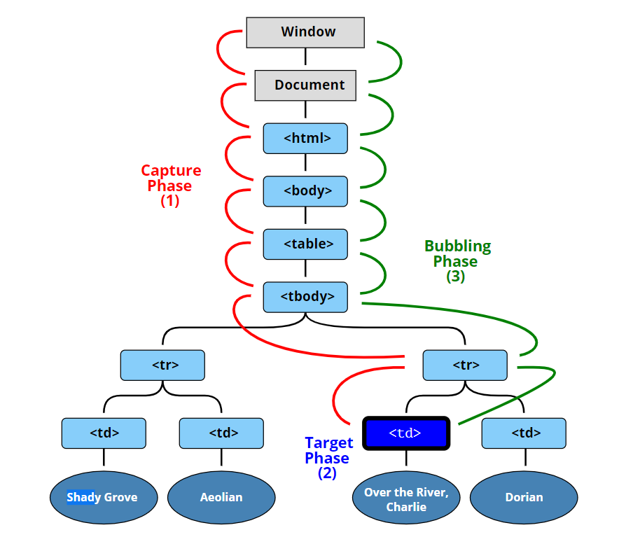

## Demo

<a href="https://shigatsuel.github.io/javascript30-challenge/Day-25(Event-Capture+Propagation+Bubbling+Once)/index.html" target="_blank">Day 25 - Event Capture, Propagation, Bubbling and Once</a>

## HTML 코드

```
<body>
  <body class="bod">

    <div class="one">
      <div class="two">
        <div class="three">
        </div>
      </div>
    </div>

    <button></button>
</body>
```

## JavaSciprt 코드

```
const divs = document.querySelectorAll("div");
const button = document.querySelector("button");

function logText(e) {
  console.log(this.classList.value);
  // e.stopPropagation();
}

function init() {
  divs.forEach((div) => div.addEventListener("click", logText));
  // document.body.addEventListener("click", logText);
  /* divs.forEach((div) =>
    div.addEventListener("click", logText, { capture: true })
  ); */
  button.addEventListener(
    "click",
    () => {
      console.log("Click!!!");
    },
    { once: true }
  );
}

init();
```

이번 챌린지에서는 버블링, 캡처링, 프로퍼게이션 그리고 once에 대해서 알아보았다.<br>
학교다닐때부터 지긋지긋하게 나왔던 개념이었는데 단 한번도 제대로 이해한 적이 없었다.<br>
다시 자바스크립트를 배우고 돌아와서 버블링 / 캡처링의 개념을 살펴봤는데 거짓말처럼 이해가 잘갔다. 이벤트를 하두 많이 써서 그런걸까..?<br>
어쨋든 간단하게 설명을 해보겠습니다.<br>

<br>

먼저 이벤트는 최상위에서 아래로 전파되는 캡처링 단계가 존재하고 이벤트 타겟에 도착해 실행이 된 후(캡처 단계) 다시 최상위로 전파됩니다.(버블링 단계)<br>
이벤트를 써보시면 아시겠지만 캡처링 이벤트를 쓰는 경우는 이제 거의 없습니다.<br>
버블링 단계는 이벤트가 마치 방울처럼 타고 올라가기 때문에 붙혀진 이름이라고 합니다.<br>

먼저 divs 박스들에 클릭 이벤트를 추가한 후 가장 안에 있는 박스를 클릭하면 three -> two -> one 순서대로 콘솔로그에 찍힙니다.<br>
그 이유는 자신 먼저 실행이 되고 이어서 부모 요소의 핸들러가 동작되고 가장 최상단 조상 요소를 만날 때까지 실행되기 때문입니다.<br>

document.body.addEventListener("click", logText); 를 추가하면 three -> two -> one -> bod 순으로 출력이 됩니다.<br>

만약에 divs.forEach((div) =>
div.addEventListener("click", logText, { capture: true })
); 를 통해 이벤트를 캡처링 단계부터 시작하면 bod -> one -> two -> three 순으로 실행되겠죠.<br>

Propagation은 버블링을 중단하는 메서드입니다.<br>
위와 같이 e.stopPropagation(); 를 추가한 후에 가장 안에 있는 박스를 클릭하게 되면 three 밖에 출력되지 않습니다. 즉 위로 버블링이 올라가지 못하게 막는 것이죠<br>
여기에 만약 캡처링 이벤트를 추가하면? -> bod 만 나오게 됩니다 :)<br>
Propagation은 멈추는 역할을 해줘서 좋을 때도 있지만 왠만하면 사용하지 않는 것이 좋다고 합니다.<br>

마지막으로 once라는 option에 대해서 알아보겠습니다.<br>
option은 최근에 추가된 것으로 위와 같이 once: true로 설정하게 되면 이벤트가 단 한번만 실행되고 이벤트가 더 이상 실행이 되지 않습니다.<br>
버튼을 눌러보시고 콘솔로그로 확인해 봅시다.<br>

(참고: [JavaScript-Info](https://ko.javascript.info/bubbling-and-capturing#ref-11))
