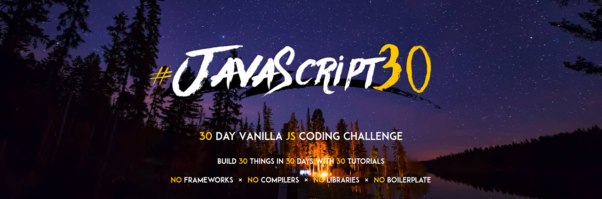

# JavaScript 30 Challenge

## Introdution

 
유튜브 클론 코딩을 하던 중에, JavaScript 검색을 하다 굉장히 흥미로운 웹사이트를 찾아냈다. 
`wesbos`의 `JavaScript30 Challenge`로 VanillaJS를 주제로 한 30일짜리 챌린지였다. 
굉장히 흥미로운 내용들을 다루고 있었고, 이 모든 것을 바닐라JS로 할 수 있다는 것이 믿기지 않았다. 
안그래도 유튜브 클론 코딩을 하면서 바닐라JS를 통해 더 많이 만들어 봐야 겠다는 생각을 했었는데 이 챌린지를 통해 내가 부족한 바닐라JS 부분을 채울 수 있다는 생각이 들었다. 
유튜브 클론 코딩이 끝나면 이 챌린지를 통해 더 많은 바닐라JS를 다뤄볼 생각이다. 

## Things to know

챌린지를 시작하기 앞서 살짝 맛만 보고 든 생각은 내가 원한 챌린지 형식은 아니었다. 
문제를 주고 내가 스스로 만들어보는 것을 생각했었으나 이것이 아니였고, 영상을 보면서 따라 만드는 형식이었다. 
문제가 주어져있다면 영상을 안보고 스스로 만드는 것도 가능했을테지만 그것도 불가능한 것 같다. 
따라서 이 챌린지를 효과적으로 참여하기 위해 몇가지 룰을 적용해보려 한다. 
`1️⃣따라 만들되, 나만의 챌린지로 새롭게 만들어본다.` 
복사 붙여넣기 식으로 하는 것이 아니라 영상을 보고 내가 생각하는 것을 적용해보는 것 이다. 
`2️⃣모르는 부분이 생기면 넘어가지 말고 반드시 관련 문서를 찾아봐서 정리할 것` 

---

## Day

이 챌린지의 목표는 30일 안에 끝내는 것이다. 
또한 하루에 한 개 이상은 무조건 하는 것을 전제로 절대 미루는 일이 없도록 한다. 

| Day |                                                                                                Title                                                                                                |   Date   |
| :-: | :-------------------------------------------------------------------------------------------------------------------------------------------------------------------------------------------------: | :------: |
| 01  |                        <a href="https://shigatsuel.github.io/javascript30-challenge/Day-01(JavaScript-Drum-Kit)/index.html" target="_blank">Day 01 - JavaScript Drum Kit</a>                        | 20.11.08 |
| 02  |                             <a href="https://shigatsuel.github.io/javascript30-challenge/Day-02(JS+CSS_Clock)/index.html" target="_blank">Day 02 - JS and CSS Clock</a>                             | 20.11.09 |
| 03  |            <a href="https://shigatsuel.github.io/javascript30-challenge/Day-03(Playing-with-CSS-variables+JS)/index.html" target="_blank">Day 03 - Playing with CSS variables and JS</a>            | 20.11.09 |
| 04  |                         <a href="https://shigatsuel.github.io/javascript30-challenge/Day-04(Array-Cardio-Day-1)/index.html" target="_blank">Day 04 - Array Cardio Day 1</a>                         | 20.11.11 |
| 05  |                  <a href="https://shigatsuel.github.io/javascript30-challenge/Day-05(Flex-Panels-Image-Gallery)/index.html" target="_blank">Day 05 - Flex Panels Image Gallery</a>                  | 20.11.11 |
| 06  |                            <a href="https://shigatsuel.github.io/javascript30-challenge/Day-06(Ajax-Type-Ahead)/index.html" target="_blank">Day 06 - Ajax Type Ahead</a>                            | 20.11.12 |
| 07  |                         <a href="https://shigatsuel.github.io/javascript30-challenge/Day-07(Array-Cardio-Day-2)/index.html" target="_blank">Day 07 - Array Cardio Day 2</a>                         | 20.11.12 |
| 08  |                      <a href="https://shigatsuel.github.io/javascript30-challenge/Day-08(Fun-with-HTML5-Canvas)/index.html" target="_blank">Day 08 - Fun with HTML5 Canvas</a>                      | 20.11.12 |
| 09  |              <a href="https://shigatsuel.github.io/javascript30-challenge/Day-09(14-Must-Know-Dev-Tools-Tricks)/index.html" target="_blank">Day 09 - 14 Must Know Dev Tools Tricks</a>              | 20.11.12 |
| 10  |    <a href="https://shigatsuel.github.io/javascript30-challenge/Day-10(Hold-Shift-to-Check-Multiple-Checkboxes)/index.html" target="_blank">Day 10 - Hold Shift to Check Multiple Checkboxes</a>    | 20.11.13 |
| 11  |                  <a href="https://shigatsuel.github.io/javascript30-challenge/Day-11(Custom-HTML5-Video-Player)/index.html" target="_blank">Day 11 - Custom HTML5 Video Player</a>                  | 20.11.13 |
| 12  |                     <a href="https://shigatsuel.github.io/javascript30-challenge/Day-12(Key-Sequence-Detection)/index.html" target="_blank">Day 12 - Key Sequence Detection</a>                     | 20.11.13 |
| 13  |                         <a href="https://shigatsuel.github.io/javascript30-challenge/Day-13(Slide-In-On-Scroll)/index.html" target="_blank">Day 13 - Slide In On Scroll</a>                         | 20.11.13 |
| 14  |          <a href="https://shigatsuel.github.io/javascript30-challenge/Day-14(Object+Arrays-Reference-VS-Copy)/index.html" target="_blank">Day 14 - Object and Arrays Reference VS Copy</a>          | 20.11.13 |
| 15  |            <a href="https://shigatsuel.github.io/javascript30-challenge/Day-15(LocalStorage+Event-Delegation)/index.html" target="_blank">Day 15 - LocalStorage and Event Delegation</a>            | 20.11.14 |
| 16  |          <a href="https://shigatsuel.github.io/javascript30-challenge/Day-16(CSS-Text-Shadow-Mouse-Move-Effect)/index.html" target="_blank">Day 16 - CSS Text Shadow Mouse Move Effect</a>          | 20.11.14 |
| 17  |        <a href="https://shigatsuel.github.io/javascript30-challenge/Day-17(Sorting-Band-Names-without-Articles)/index.html" target="_blank">Day 17 - Sorting Band Names without Articles</a>        | 20.11.14 |
| 18  |             <a href="https://shigatsuel.github.io/javascript30-challenge/Day-18(Tally-String-Times-with-Reduce)/index.html" target="_blank">Day 18 - Tally String Times with Reduce</a>             | 20.11.14 |
| 19  |                          <a href="https://shigatsuel.github.io/javascript30-challenge/Day-19(Unreal-Webcam-Fun)/index.html" target="_blank">Day 19 - Unreal Webcam Fun</a>                          | 20.11.15 |
| 20  |                  <a href="https://shigatsuel.github.io/javascript30-challenge/Day-20(Native-Speech-Recognition)/index.html" target="_blank">Day 20 - Native Speech Recognition</a>                  | 20.11.15 |
| 21  |  <a href="https://shigatsuel.github.io/javascript30-challenge/Day-21(Geolocation-based-Speedometer-and-Compass)/index.html" target="_blank">Day 21 - Geolocation based Speedometer and Compass</a>  | 20.11.15 |
| 22  |                         <a href="https://shigatsuel.github.io/javascript30-challenge/Day-22(Follow-Along-Links)/index.html" target="_blank">Day 22 - Follow Along Links</a>                         | 20.11.15 |
| 23  |                           <a href="https://shigatsuel.github.io/javascript30-challenge/Day-23(Speech-Synthesis)/index.html" target="_blank">Day 23 - Speech Synthesis</a>                           | 20.11.16 |
| 24  |                                 <a href="https://shigatsuel.github.io/javascript30-challenge/Day-24(Sticky-Nav)/index.html" target="_blank">Day 24 - Sticky Nav</a>                                 | 20.11.16 |
| 25  | <a href="https://shigatsuel.github.io/javascript30-challenge/Day-25(Event-Capture+Propagation+Bubbling+Once)/index.html" target="_blank">Day 25 - Event Capture, Propagation, Bubbling and Once</a> | 20.11.16 |
| 26  |               <a href="https://shigatsuel.github.io/javascript30-challenge/Day-26(Stripe-Follow-Along-Dropdown)/index.html" target="_blank">Day 26 - Stripe Follow Along Dropdown</a>               | 20.11.16 |
| 27  |                     <a href="https://shigatsuel.github.io/javascript30-challenge/Day-27(Click+Drag-to-Scroll)/index.html" target="_blank">Day 27 - Click and Drag to Scroll</a>                     | 20.11.17 |
| 28  |                  <a href="https://shigatsuel.github.io/javascript30-challenge/Day-28(Video-Speed-Controller-UI)/index.html" target="_blank">Day 28 - Video Speed Controller UI</a>                  | 20.11.17 |
| 29  |                            <a href="https://shigatsuel.github.io/javascript30-challenge/Day-29(Countdown-Clock)/index.html" target="_blank">Day 29 - Countdown Clock</a>                            | 20.11.17 |
| 30  |                          <a href="https://shigatsuel.github.io/javascript30-challenge/Day-30(Whack-A-Mole-Game)/index.html" target="_blank">Day 30 - Whack A Mole Game</a>                          | 20.11.17 |

---

## Finish

며칠이 걸렸는지 모르겠다. 감기몸살 때문에 10일정도 걸린 것 같은데... 생각보다 오래걸린 듯 하다. 

처음에 시작할 때 목표는 단순히 따라하는 것이 아닌 내것으로 만들기 위함으로 조건을 몇가지 걸었었는데 생각보다 그렇게하지 못한 챌린지들이 너무 많았다. 
단순히 따라하며 이해하는 것으로도 시간이 많이 소요되어서 그런 듯 싶다. 
그래도 다행히 앞에서 개념공부를 많이 했기 때문에 며칠전이라면 이해를 못했을 것 같은 코드들도 쉽게 이해할 수 있었다. 안그래도 영어로 강의를 하는데 모르는 것이 주구장창 생겼다면 이 챌린지를 끝까지 할 수 있었을까 싶다. 

최종적으로 이제 30개의 모든 챌린지를 이해할 수는 있게 되었다. 그리고 몇 가지 스킬들도 배워 앞으로 유용하게 사용할 수 있을 것 같다. 
문제점은 며칠만 지나면 내가 했던 이 챌린지를 분명히 다 까먹게 되겠지.. 그렇지 않게 하기 위해서 이 레포지토리를 개설했고 언제든지 다시 볼수 있도록 해뒀다. 
이 챌린지가 끝나서도 내가 해야할 부분은 챌린지 30가지를 하면서 공통적으로 그리고 많이 쓰이는 개념들이 몇가지 있었는데 그것을 따로 정리해두지 않으면 내 기억속에서 삭제 될 것이다. 이 부분을 따로 정리라도 해뒀으면 좋겠다는 생각을 마지막으로 Finish 파트를 마무리 하겠습니다. :) 

---

## Concept

1. 어떤 구체적인 정보를 JS에서 사용해야할 때, dataset을 사용해 사용자 지정 데이터 특성을 이용하면 굳이 어렵게 JS에서 값을 구하지 않아도 쉽게 사용할 수 있습니다.(name도 마찬가지)

2. this와 event.target의 차이를 잘 이해한다면 어떤 DOM ELEMENT라도 사용할 수 있습니다.

3. 배열을 사용하면 동일한 여러 작업을 아주 빠르게 할 수 있습니다. 특히 map -> join 단계를 거처 큰 String으로 변환하고 이것을 innerHTML을 사용해 내용을 집어넣는 작업을 할 때 아주 유용하게 사용될 수 있습니다.

4. Boolean값을 사용하면 작업을 원하는 때에 지정해서 실행할 수 있습니다. 예를 들어 true -> false & false -> true로 바뀌는 것을 감지할 때 특정 작업을 실행하는 것입니다.

5. 최근 트렌드는 마우스의 움직임에 따라 결정되는 동작들이 많다. 한국인들은 귀찮은 것은 딱 질색이기 때문... 마우스가 어디에 초점을 두는지 얼마나 이동했는지를 알기위해서 이벤트를 필수적으로 이용해야 한다. 그 중 offset, client, page, screen 등의 차이를 잘 알아둬야 하고 
   getBoundingClientRect()등의 전역 메서드를 잘 사용해야 한다.

6. 아직은 많이 사용할 일이 없지만 분명히 WEB API를 잘 써야할 순간이 올 것이다. SpeechRecognition(음성 인식) / navigator.geolocation 등(우리가 웹에서 사용하는 전역 기능들) / SpeechSynthesis & SpeechSynthesisUtterance(음성 요청) 외에도 많이 있지만 아직 모르는 것들도 한참 많이 남아있다.

7. window.scroll은 scroll이벤트를 사용할 때 가장 많이 사용하게 된다. 여기서도 offset / page 등 x,y 위치를 잡는 것이 매우 중요하며 스크롤링을 했을 때 window.scrollX or scrollY 등을 잘 활용해주면 스크롤한 상태에서도 이벤트를 유지할 수 있다.

이 외에도 많은 컨셉들이 있지만 찾을때마다 업데이트 해보도록 하겠습니다. :)
